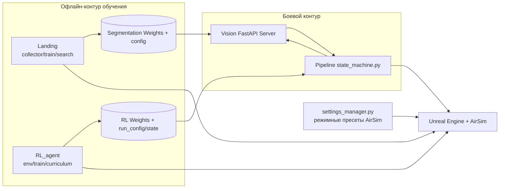

# Общая архитектура дипломного проекта

## 1. Концепция системы

Проект реализует гибридную систему автономного полета БПЛА в симуляторе Unreal Engine + AirSim и состоит из трех логически изолированных модулей:

- `RL_agent/` — обучение агента глобальной навигации (долететь от старта к целевой области).
- `Landing/` — построение и обучение модели семантической сегментации для безопасной посадки.
- `Pipeline/` — боевой оркестратор миссии (state machine), который объединяет RL-навигацию и посадку на основе CV и геометрии.

Архитектурный принцип: **декуплинг по жизненным циклам**.
- `RL_agent` и `Landing` — офлайн/исследовательские контуры (сбор данных, обучение, подбор гиперпараметров).
- `Pipeline` — онлайн/боевой контур исполнения миссии на уже обученных артефактах.

## 2. Связность и изоляция модулей

### Изоляция
- Каждый модуль имеет собственные конфиги, менеджеры запуска и сценарии выполнения.
- Модули могут развиваться независимо: обновление сегментационной модели не требует переобучения RL-агента, и наоборот.

### Интеграция
- `Pipeline` использует артефакты из других модулей:
  - RL-веса и `run_config.json` из `RL_agent/models/...`
  - веса сегментации и `config.json` из `Landing/runs/segmentation/...`
- Инференс сегментации вынесен в отдельный FastAPI-сервис (`Pipeline/modules/vision_server.py`), вызываемый клиентом `Pipeline/modules/vision.py`.

## 3. Роль `settings_manager.py`

`settings_manager.py` — глобальный инфраструктурный слой согласования AirSim-конфигурации (`~/Documents/AirSim/settings.json`) под конкретный режим выполнения:

- `rl_train` / `rl_test` — профиль камер и параметров для RL.
- `collect` / `land` — профиль для нижней камеры и сбора/посадки.
- `pipeline` — объединенный профиль для фронтальной (RL) и нижней (landing) камер.

Функция `ensure_settings(mode)` гарантирует, что режим запуска соответствует требуемому профилю сенсоров и симуляции; при расхождении конфиг автоматически перезаписывается.

## 4. Высокоуровневая архитектура

## 5. Архитектурный итог

Проект реализует модульную hybrid AI-систему: RL решает задачу глобальной навигации, CV+геометрия — локальной безопасной посадки, а Pipeline обеспечивает управляемое переключение между фазами полета в рамках конечного автомата.