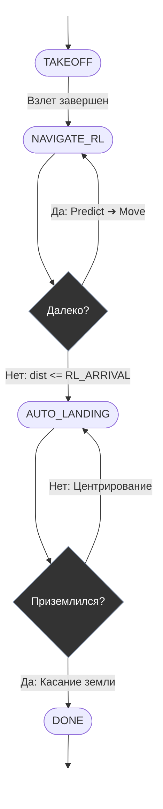
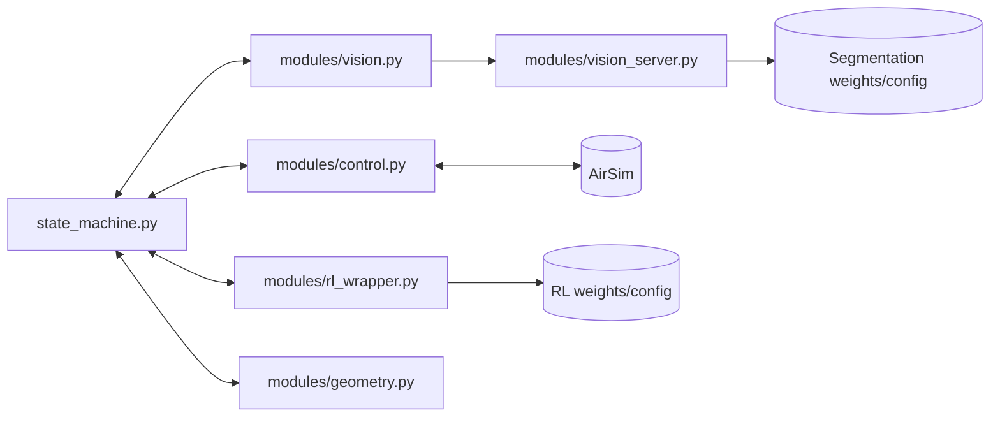

# Модуль Pipeline
## 1. Архитектура пайплайна
`Pipeline` — интеграционный модуль исполнения миссии в реальном времени. Центральный компонент — `state_machine.py`, который последовательно выполняет:
1. взлет;
2. навигацию к целевой зоне RL-агентом;
3. переключение в режим автопосадки;
4. выбор безопасной точки по семантике + геометрии;
5. снижение и завершение миссии.
Модуль работает поверх AirSim API и использует:
  - RL-модель из `RL_agent`,
  - сегментационную модель через FastAPI-сервис (`modules/vision_server.py`).
## 2. Разбор `state_machine.py`
Определены состояния `DroneState`:
- `TAKEOFF`
- `NAVIGATE_RL`
- `AUTO_LANDING`
- `DONE`
### `TAKEOFF`
- arm + takeoff на `TAKEOFF_ALTITUDE`;
- прогрев фронтальной depth-камеры;
- переход в `NAVIGATE_RL`.
### `NAVIGATE_RL`
- получение depth-кадра `front_center`;
- проверка на пустой кадр;
- вычисление дистанции до цели;
- если достигнут радиус прибытия (`RL_ARRIVAL_DISTANCE`) → остановка + переход в `AUTO_LANDING`;
- иначе:
  - формирование вектора до цели в body frame,
  - инференс действия RL-моделью,
  - отправка velocity-команды в мир через `control.py`.
### `AUTO_LANDING`
- получение `bottom_rgb` и `bottom_depth`;
- запрос семантической маски у сервера (`vision.py`);
- вычисление безопасной точки (`geometry.py`):
  - маска безопасного класса,
  - ограничение по уклону,
  - distance transform + оптимизационный score;
- если безопасная точка не найдена: стабилизация/выравнивание и повтор;
- если найдена:
  - PID-коррекция `vx, vy` до центрирования точки под дроном;
  - контролируемое снижение по `LANDING_SPEED_Z`;
  - при малой высоте (`< 0.4 м`) — disarm и `DONE`.
## 3. Взаимодействие с папкой `modules`
- `control.py` (`DroneController`):
  - AirSim-команды управления и сенсоры,
  - перевод UE→NED, оценка дистанции и GPS-цели,
  - PID-компонент для фазы посадки.
- `vision.py` (`VisionPipeline`):
  - HTTP-клиент к FastAPI,
  - сериализация кадра в base64 и декод маски.
- `geometry.py` (`LandingMath`):
  - оценка уклона поверхности,
  - объединение семантических и геометрических ограничений,
  - выбор landing spot.
- `rl_wrapper.py` (`RLNavigator`):
  - загрузка PPO-модели,
  - предобработка depth + frame stacking,
  - расчет вектора до цели в системе дрона.
- `vision_server.py`:
  - отдельный сервис инференса сегментации,
  - загружает архитектуру и веса из сохраненного train-конфига.
## 4. Диаграмма автомата состояний

## 5. Диаграмма взаимодействия модулей

## 6. Архитектурный смысл

`Pipeline` реализует строгую фазовую декомпозицию: RL отвечает за макронавигацию, а CV+геометрия+PID — за микроманевр посадки. Это снижает сложность единой end-to-end политики и повышает интерпретируемость системы.
