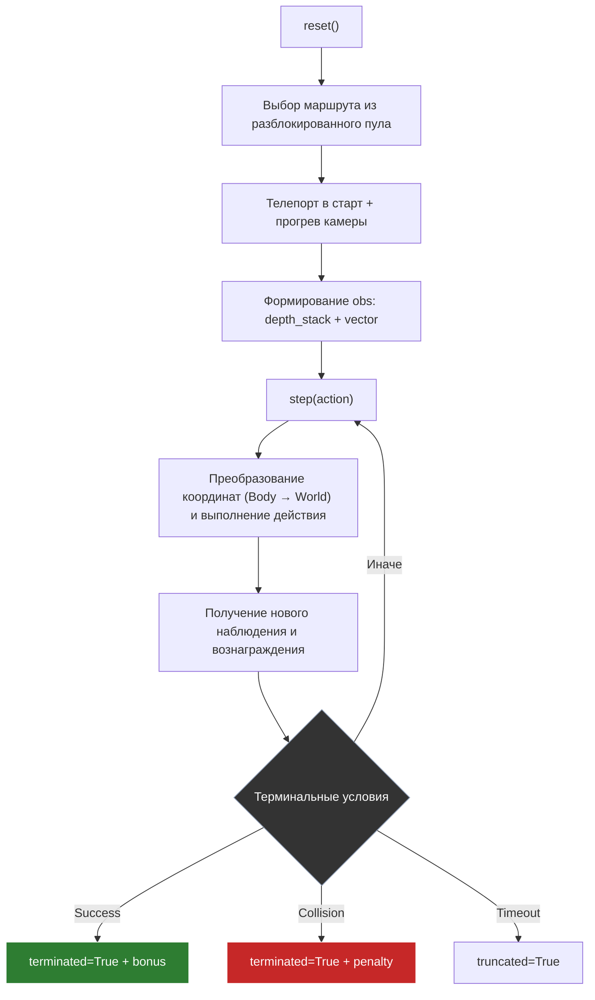
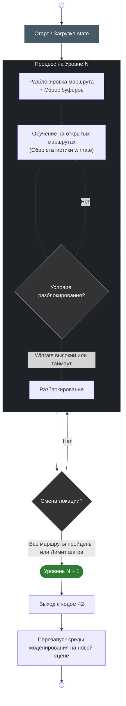

# Модуль RL_agent
## 1. Назначение модуля
`RL_agent` реализует обучение агента автономной навигации в AirSim на основе многомодального наблюдения:
- стек depth-кадров (пространственно-временной контекст),
- вектор до цели в body frame (направление + нормализованная дистанция).
Поддерживаются алгоритмы `PPO` и `SAC` (`config.py`), приоритетно используется curriculum-подход с поэтапным усложнением маршрутов и уровней.
## 2. Связка `manager.py -> train.py -> env.py`
### `manager.py` (оркестрация процесса)
- вызывает `ensure_settings("rl_train")`;
- при необходимости генерирует `routes_config.json` через `utils.generate_config(...)`;
- определяет текущую карту по `state.json` и запускает UE именно на нужном уровне;
- запускает `train.py` как подпроцесс;
- анализирует код возврата:
  - `0` — штатное завершение;
  - `42` — сигнал смены уровня (перезапуск UE на новой карте);
  - иначе — аварийный рестарт цикла.
### `train.py` (алгоритм и логика обучения)
- поднимает watchdog-поток (защита от зависаний UE/step-loop);
- создает среду `ColosseumDroneEnv`, оборачивает в `Monitor` и `DummyVecEnv`;
- строит мультимодальный extractor:
  - CNN-ветка для depth,
  - MLP-ветка для вектора,
  - Слияние в общий эмбеддинг;
- инициализирует PPO/SAC с параметрами из `config.py`;
- поддерживает resume:
  - `latest_model.zip`,
  - `state.json`,
  - `replay_buffer.pkl` (для SAC);
- запускает `CurriculumCallback`, который:
  - ведет статистику успехов по маршрутам,
  - открывает новые маршруты,
  - повышает уровень,
  - сохраняет прогресс.
### `env.py` (Gymnasium-среда)
- подключается к AirSim и читает `routes_config.json`;
- на `reset()` выбирает маршрут из пула разблокированных;
- формирует наблюдение:
  - depth с шумами и dropout (sim-to-real),
  - вектор до цели в системе дрона;
- на `step(action)`:
  - преобразует действие из body frame в world frame,
  - отправляет команду в AirSim,
  - считает reward:
    - прогресс к цели,
    - шаговый штраф,
    - бонус за успех,
    - сильный штраф за коллизию;
  - завершает эпизод по успеху/столкновению/таймауту маршрута.
## 3. Curriculum Learning: логика смены уровней
Curriculum реализован в `CurriculumCallback`:
- ведутся буферы успешности по каждому маршруту (`deque` фиксированной длины);
- через заданный интервал шагов проверяются условия:
  1) **разблокирование route по quality**: если winrate по всем открытым маршрутам >= порога;
  2) **разблокирование route по timeout**: если слишком долго нет прогресса;
  3) **level up по mastery**: если все маршруты уровня освоены;
  4) **level up по timeout**: если превышен лимит шагов уровня.
- при смене уровня вызывается `env.set_level(new_lvl)` и процесс завершает текущий запуск кодом `42`, чтобы `manager.py` перезапустил UE на новой карте.
Таким образом, переходы между уровнями синхронизированы с инфраструктурой симулятора и не завязаны на «горячую» замену карты внутри одного процесса.
## 4. Диаграмма жизненного цикла среды

## 5. Диаграмма переходов по уровням (Curriculum)

## 6. Архитектура нейронной сети

```mermaid
flowchart LR
    subgraph Input ["Входные данные"]
        direction TB
        D["Карты глубины<br/>(Тензор 4 × 84 × 84)"]
        V["Кинематический вектор<br/>(Вектор 4 × 1)"]
    end

    subgraph Extractor ["Мультимодальный экстрактор признаков"]
        subgraph CNN["Сверточная ветвь (CNN)"]
            direction TB
            C1["Conv2d: 32 фильтра, 8×8, s=4<br/>+ ReLU"]
            C2["Conv2d: 64 фильтра, 4×4, s=2<br/>+ ReLU"]
            C3["Conv2d: 64 фильтра, 3×3, s=1<br/>+ ReLU"]
            F["Flatten (Выравнивание)"]
            C1 --> C2 --> C3 --> F
        end

        subgraph MLP ["Многослойный персептрон (MLP)"]
            direction TB
            M1["Linear: 64 нейрона<br/>+ ReLU"]
            M2["Linear: 64 нейрона<br/>+ ReLU"]
            M1 --> M2
        end

        Merge{"Конкатенация<br/>признаков"}
        OutFC["Полносвязный слой<br/>320 нейронов + ReLU"]
    end

    subgraph Heads ["Архитектура Actor-Critic"]
        direction TB
        Actor["Сеть Actor (Политика)<br/>2 слоя по 128 нейронов"]
        Critic["Сеть Critic (Функция ценности)<br/>2 слоя по 128 нейронов"]
        ActOut["Действие: a =[v_x, v_y, v_z]"]
        CritOut["Оценка состояния: V(s)"]
    end

    D --> C1
    V --> M1
    
    F --> Merge
    M2 --> Merge
    Merge --> OutFC

    OutFC --> Actor
    OutFC --> Critic

    Actor --> ActOut
    Critic --> CritOut
    
    style Input fill:#2c3e50,stroke:#8B9BB4,color:#fff
    style CNN fill:#34495e,stroke:#8B9BB4,color:#fff
    style MLP fill:#34495e,stroke:#8B9BB4,color:#fff
    style Heads fill:#34495e,stroke:#8B9BB4,color:#fff
    style Merge fill:#006064,stroke:#fff,color:#fff
    style OutFC fill:#00838f,stroke:#fff,color:#fff
```

## 7. Архитектурный вывод

`RL_agent` сочетает алгоритмический контур RL и инфраструктурный контур управления симулятором. Благодаря этому обучение устойчиво к зависаниям и масштабируется по сложности среды через формализованный curriculum-механизм.
